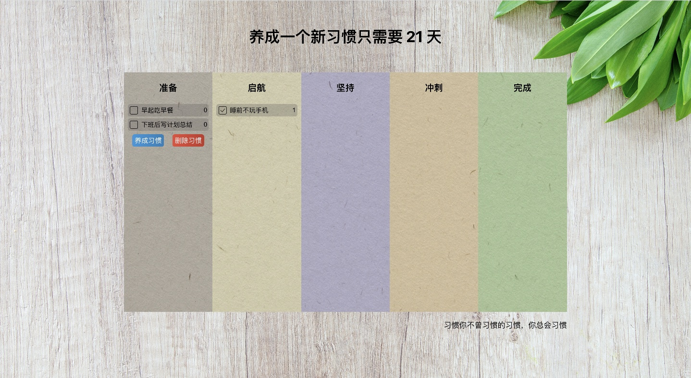

# 养成一个新习惯只需要 21 天

20230723: 上线 0.0.1 版本，具备了**养成新习惯**核心功能；

20230901: 上线 0.0.2 版本，提升工程化；

[线上体验地址](https://stars-chan.github.io/twenty-one/)


## 开发流程

开发分支完成后，`merge` 到 `main` 分支后再部署

v0.0.2（已上线）

- [x] 全面使用函数式组件
- [x] 增加重置以及多次累加功能
- [x] 全面支持 TS，支持 webpack 配置

v.0.0.3（开发中）

- [ ] 使用 react-redux 对状态进行管理
- [ ] less 样式库
- [ ] 增加树苗成长

## 本地运行

### 1-克隆项目到本地:

```
git clone git@github.com:Stars-Chan/twenty-one.git
cd twenty-one
```

### 2-安装依赖并启动

```
yarn
yarn start
```

或者

```
npm install
npm start
```

### 3-打开项目

推荐用谷歌浏览器打开 [http://localhost:3000](http://localhost:3000)

## 部署到 `Github Page`

### 1-同步

将本地代码同步到 github 仓库上

### 2-修改 package.json 文件

（1）配置 homepage

```
"homepage": "https://stars-chan.github.io/twenty-one",

```

（2）配置发布选项

```
"predeploy": "npm run build",
"deploy": "gh-pages -d build"
```

完整文件参考

```
{
  "name": "twenty-one",
  "version": "0.1.0",
  "homepage": "https://stars-chan.github.io/twenty-one",
  "private": true,
  "dependencies": {
    "@reduxjs/toolkit": "^1.9.5",
    "@testing-library/jest-dom": "^5.17.0",
    "@testing-library/react": "^13.4.0",
    "@testing-library/user-event": "^13.5.0",
    "react": "^18.2.0",
    "react-dom": "^18.2.0",
    "react-redux": "^8.1.1",
    "react-scripts": "5.0.1",
    "redux": "^4.2.1",
    "web-vitals": "^2.1.4"
  },
  "scripts": {
    "start": "react-scripts start",
    "build": "react-scripts build",
    "test": "react-scripts test",
    "eject": "react-scripts eject",
    "predeploy": "npm run build",
    "deploy": "gh-pages -d build"
  },
  "eslintConfig": {
    "extends": [
      "react-app",
      "react-app/jest"
    ]
  },
  "browserslist": {
    "production": [
      ">0.2%",
      "not dead",
      "not op_mini all"
    ],
    "development": [
      "last 1 chrome version",
      "last 1 firefox version",
      "last 1 safari version"
    ]
  },
  "devDependencies": {
    "gh-pages": "^5.0.0"
  }
}
```

### 3-安装 gh-pages

```
npm install gh-pages --save-dev
```

### 4-部署项目

```
npm run deploy
```

配置完之后，twenty-one 仓库会多了一个 `gh-pages` 分支，存放的是项目打包编译完成之后的静态文件，在 `Settings -> Pages` 下，可以看到项目已经被成功部署

### 5-重新部署

将修改后代码同步到远程仓库后部署

```
npm run deploy
```
